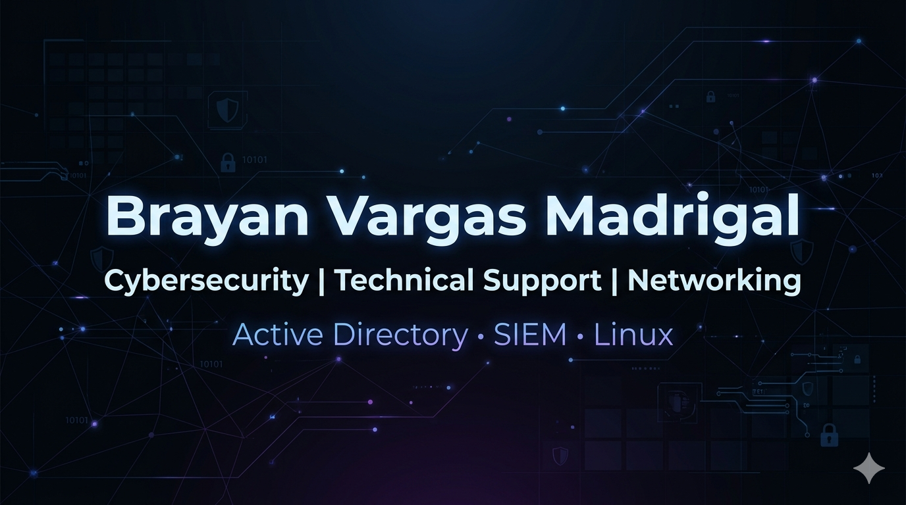

<!-- HEADER -->

<h1 align="center">Brayan Vargas Madrigal</h1>
<h3 align="center">Cybersecurity | Technical Support | Systems</h3>

  Computer Science Student @ UCR  
  Technical in Cybersecurity  
  Focused on technical support, network and defensive security

---

<!-- BANNER -->

  

---

<!-- ABOUT -->

<h2>About Me</h2>

IT and cybersecurity technician with experience in technical support, basic systems administration, and virtualized environments. Currently focused on developing skills in defensive cybersecurity, log analysis, and practical labs with Active Directory and SIEM.

<ul>
  <li>Experiencia en soporte técnico L1 y troubleshooting</li>
  <li>Gestión básica de usuarios en Active Directory</li>
  <li>Configuración y mantenimiento de sistemas Windows y Linux</li>
  <li>Implementación de redes y resolución de problemas</li>
  <li>Enfoque en mejora continua y aprendizaje práctico</li>
</ul>

---

<!-- TECH STACK -->

<h2>Tech Stack</h2>

<b>Languages</b>

Java • Python • C# • PowerShell • Javascript

<b>Systems & Environments</b>

Linux (Ubuntu Server, Kali Linux, Purple Team Linux)  
Windows 10 / 11 • Windows Server  
Virtual Machines (lab environments)

<b>Cybersecurity</b>

Active Directory (user management & lab in progress)  
SIEM: Wazuh  
Network Analysis: Wireshark (basic)  
Cybersecurity best practices

<b>Networking</b>

TCP/IP • DNS • DHCP • Wi-Fi

<b>Tools</b>

GitHub • Bash • PowerShell  
Remote Support: AnyDesk • TeamViewer

---

<!-- EXPERIENCE -->

<h2>Experience</h2>

<b>Procuraduría General de la República</b> — Technical Support Intern  

<ul>
  <li>Preventive and corrective maintenance of computer equipment</li>
  <li>Technical support and troubleshooting for end users</li>
  <li>Incident resolution under defined procedures</li>
  <li>Clear communication with internal users to ensure service quality</li>
</ul>

---

<!-- CERTIFICATIONS -->

<h2>Certifications</h2>

<ul>
  <li>CCNA: Switching, Routing and Wireless Essentials</li>
  <li>Linux Essentials</li>
  <li>Technical Support Fundamentals (Google)</li>
  <li>Defensive Cybersecurity</li>
  <li>Advanced Python</li>
</ul>

---

<!-- PROJECTS -->

<h2>Projects</h2>

<ul>
  <li><b>Encrypted Backup Automation</b> — PowerShell scripts for secure backups</li>
  <li><b>Home Network Setup</b> — Network implementation and configuration</li>
  <li><b>Active Directory Lab</b> (in progress) — Security and monitoring scenarios</li>
</ul>

---

<!-- CURRENT FOCUS -->

<h2>Current Focus</h2>

<ul>
  <li>Active Directory attack & defense scenarios</li>
  <li>SIEM monitoring and log analysis (Wazuh)</li>
  <li>Building a cybersecurity home lab portfolio</li>
</ul>

---

<!-- CONTACT -->

<h2>Contact</h2>

📧 b_vargasmadrigal@outlook.com  
📍 San José, Costa Rica  
GitHub: https://github.com/brayanvargasmadrigal

---

<!-- FOOTER -->

  <i>Focused on solving real problems through technology and security</i>

